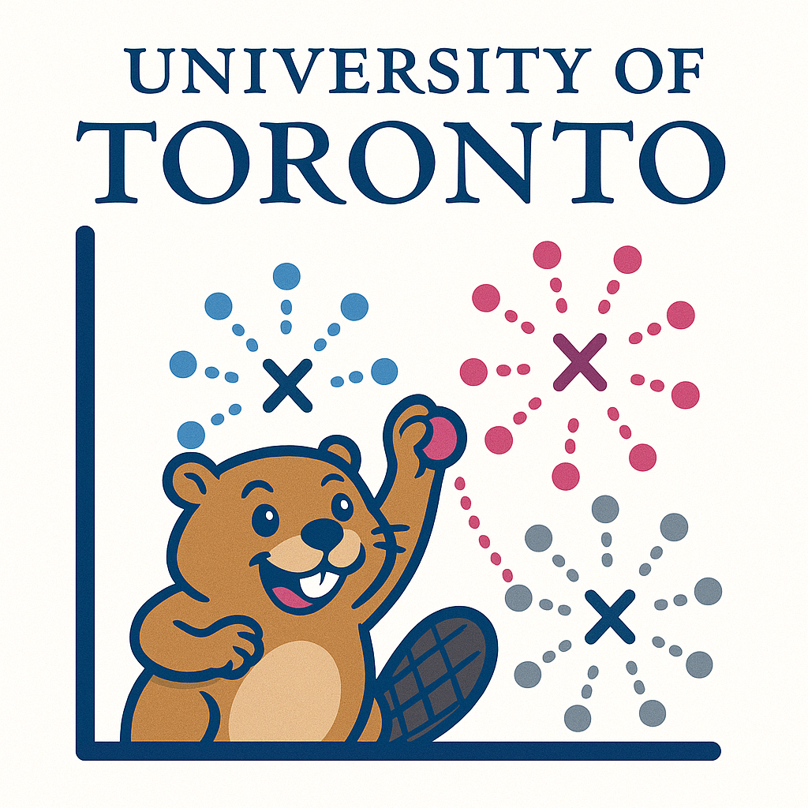

```{r setup, include=FALSE}
source("./_aux/links_supplementary.R")
source("./_aux/week01.R")
source("./_aux/week02.R")
source("./_aux/week03.R")
source("./_aux/week04.R")
source("./_aux/week05.R")
source("./_aux/week06.R")
source("./_aux/week07.R")
source("./_aux/week08.R")
source("./_aux/week09.R")
source("./_aux/week10.R")
source("./_aux/week11.R")
source("./_aux/week12.R")
source("./_aux/week13.R")
```


::: {#header}
<span class="header-title">`r course_code`: `r course_full_name`<br></span>
<span class="header-subtitle">`r university`<br>`r department`<br>`r season` `r year`</span>

::: {#header-image .img}

::: 
:::

::: {#description .sec}
This course is designed as an *in-person* course aimed at introducing the basic theory, the fundamental algorithms, and the computational toolboxes of machine learning. The focus is on a balanced treatment of the practical and theoretical approaches, along with hands on experience with relevant software packages. Supervised learning methods covered in the course will include: the study of linear models for classification and regression, neural networks. Unsupervised learning methods covered in the course will include: k-means clustering, and Gaussian mixture models. Techniques to control overfitting, including regularization and validation, will be covered. Furthermore, this course introduces the fundamental of Markov Decision Process and Reinforcement Learning.

For your convenience, all lectures and instructor's Office Hours will be also live-streamed over [Zoom](`r zoom_lec_l`). Furthermore, all lectures will be recorded and posted on the course website. Note that tutorials won't be recorded and live-streamed.
:::

## Course Staff

::: {#shuffleleft-container .col .sec}

::: instructorphoto

:::
::: instructorphoto

:::
::: instructorphoto

:::

::: instructorphoto

:::

::: instructorphoto

:::

::: instructorphoto

:::

::: instructorphoto

:::

:::


::: sechighlight
::: {#logistics .sec}
## Logistics

- **Instructors:** 
  - Erfan Meskar (e.meskar@utoronto.ca) 
  - Brendan Frey (frey@psi.utoronto.ca)
- **Lectures:** you can attend the lectures both in-person and 
over [Zoom](`r zoom_lec_l`).
  - **LEC0101:** 
    - Monday, 9:00 AM - 11:00 AM, SF 3202
    - Wednesday, 9:00 AM - 10:00 AM, SF 3202
  - **LEC0102:** 
    - Wednesday, 10:00 AM - 12:00 PM, SF 3202
    - Thursday, 9:00 AM - 10:00 AM, BA 1180
- **Tutorials:** 
  - **TUT0101:** Wednesday, 12:00 PM - 2:00 PM, Room SF 2202 (*in-person only*)
  - **TUT0102:** Wednesday, 12:00 PM - 2:00 PM, Room GB 304 (*in-person only*)
  - **TUT0103:** Wednesday, 12:00 PM - 2:00 PM, Room GB 120 (*in-person only*)
- **Office hours:**
  - Erfan Meskar (Pratt Building 371): 
  Thursdays 10:00 AM - 12:00 PM
  - Brendan Frey (BA 4136): 
  Monday 4:00 PM - 5:00 PM
  - Mohammad Yaghini (GB441): 
  Monday 12:00 PM - 1:00 PM
  - Mustafa Ammous ([Zoom](https://utoronto.zoom.us/j/84826992075)): 
  Tuesday 12:00 PM - 1:00 PM
  - Wen Xu (BA8176): 
  Wednesday 5:00 - 6:00 PM
  - Kai Wang ([Zoom](https://utoronto.zoom.us/j/82449143596)): 
  Thursday 12:00 PM - 1:00 PM
  - Aristeidis Seretis (BA4170): 
  Friday 12:00 PM - 1:00 PM
- **Contact**: 
  - Students should ask *all* course-related questions in course Piazza 
  channels. <br>
  - For personal matters only, email instructor.
- **Announcements:** All announcements will be made in Piazza.
:::
:::


::: {#coursework .sec}
## Coursework
  - **Programming Assignments (40%)**
      - There will be 4 assignments, each worth 10%.
      - You may complete them individually or in pairs, and you are free to 
      change partners for each assignment.
      - Only one submission from a group member is required. Assignments must 
      be submitted on Quercus, and the submission deadline will be at 11:59 PM.
      - Group members will receive the same grade.
  - **Midterm (25%)**
      - The midterm is closed book, 2 hours, and scheduled for Monday, 
      October 21, 9:00 AM - 11:00 AM, which will test the content of the weeks 
      before the test.
      - **Allowed Calculator Types:** Type 2 (*i.e.*, All non-programmable 
      electronic calculators)
      - **Exam Paper Type:** Type A (*i.e.*, a closed book examination, no aids 
      are permitted other than the information printed on the examination 
      paper.)
  - **Final Exam (35%)**
      - The final exam is closed book, comprehensive, 2 hours and 30 minutes, 
      and held during the exam period.
      - **Allowed Calculator Types:** Type 2 (*i.e.*, All non-programmable 
      electronic calculators)
      - **Exam Paper Type:** Type A (*i.e.*, a closed book examination, no 
      aids are permitted other than the information printed on the examination 
      paper.)

All (currently tentative) deadlines are listed in the [schedule](#schedule). 
Note that **due dates may change** based on how the course is progressing.
:::

::: {#submitting .sec}
##  Submitting Coursework
- Do not submit your coursework via email.
- If anything goes wrong, please ask a question in Piazza or contact a course 
assistant.
- You can submit as many times as you'd like until the deadline. We will only 
grade the last submission.
- Partial work is better than not submitting any work.
:::

::: {#latedays .sec}
## Late Days
5% deduction will be applied per day of lateness. No Submissions will be 
accepted after 72 hours except for documented unusual circumstances
:::

::: {#sylremark .sec}
## Regrade Requests

Regrade requests are due within 1 week of receiving the graded work and must be 
submitted by posting a private questions on Piazza.

  - We ask that you carefully review your assignments, reflect, and write a 
  short explanation justifying the reasons for a regrading request.
  - If a grade is contested and we realize that the marker made a mistake in the
  student's favour, the mark for that assignment may be lowered when the mistake
  is found. This would otherwise create a situation which is unfair to other
  students.
  - Please include your full name and UTORid in the body of the private note.
:::

::: {#sylremark .sec}
## Recommended Textbooks

- LFD: Learning From Data, AMLBook, 2012
- AIMA: Artificial Intelligence: A Modern Approach, 4th US ed.
- PRML: to an external site.: Pattern Recognition and Machine Learning
- DL: to an external site.: Deep Learning, by Goodfellow, Bengio and Courville
- SLP: to an external site.: Speech and Language Processing, by Jurafsky and Martin
:::

## Course Schedule

::: {#schedule .container .sec}

Note that in table below,

  - **pre** refers to pre-lecture note, which include incomplete sections to be filled in during lecture.
  - **post** refers to post-lecture note, representing the completed version of the pre-lecture note.
  - **vid** refers to the screencast recording of lecture.

|Week | Topics           | Readings    | Notes and<br>Recordings  | Tutorial | Coursework
|:----|:-----------------|:------------|:---------------|:-----------|:------------------------
|1<br>(Erfan)    | `r w01_top`      | `r w01_rea` | `r w01_sli`| `r w01_wsh`| `r w01_crw`               
|2<br>(Erfan)    | `r w02_top`      | `r w02_rea` | `r w02_sli`| `r w02_wsh`| `r w02_crw`
|3<br>(Erfan)    | `r w03_top`      | `r w03_rea` | `r w03_sli`| `r w03_wsh`| `r w03_crw`              
|4<br>(Erfan)    | `r w04_top`      | `r w04_rea` | `r w04_sli`| `r w04_wsh`| `r w04_crw`  
|5<br>(Brendan)    | `r w05_top`      | `r w05_rea` | `r w05_sli`| `r w05_wsh`| `r w05_crw`              
|6<br>(Brendan)    | `r w06_top`      | `r w06_rea` | `r w06_sli`| `r w06_wsh`| `r w06_crw`
|7<br>(Erfan & Brendan)    | `r w07_top`      | `r w07_rea` | `r w07_sli`| `r w07_wsh`| `r w07_crw`
|8<br>(Brendan)    | `r w08_top`      | `r w08_rea` | `r w08_sli`| `r w08_wsh`| `r w08_crw`              
|Reading Week 
|9<br>(Brendan)    | `r w09_top`      | `r w09_rea` | `r w09_sli`| `r w09_wsh`| `r w09_crw`   
|10<br>(Erfan)   | `r w10_top`      | `r w10_rea` | `r w10_sli`| `r w10_wsh`| `r w10_crw`              
|11<br>(Erfan)   | `r w11_top`      | `r w11_rea` | `r w11_sli`| `r w11_wsh`| `r w11_crw` 
|12<br>(Erfan)   | `r w12_top`      | `r w12_rea` | `r w12_sli`| `r w12_wsh`| `r w12_crw` 
|13<br>(Erfan & Brendan)   | `r w13_top`      | `r w13_rea` | `r w13_sli`| `r w13_wsh`| `r w13_crw` 
:::
